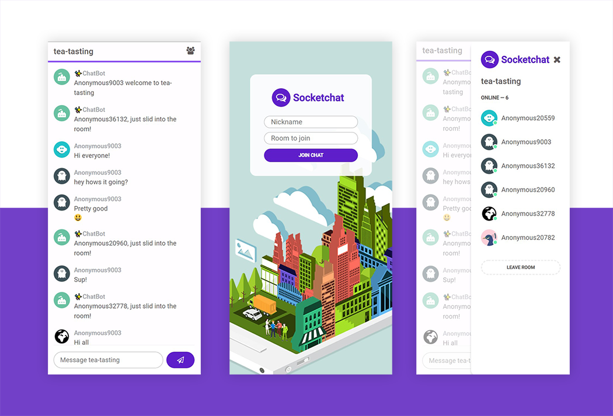
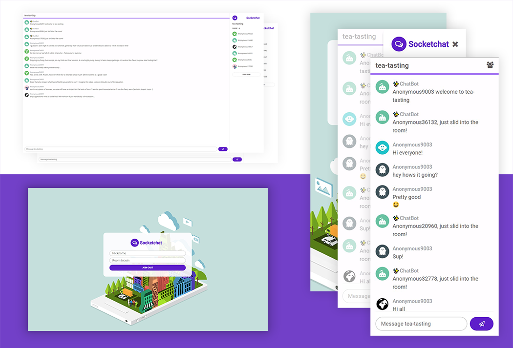

# Socketchat, mobile-first WebSockets chat app 
Socketchat Client is a frontend chat app implemented with React and Socket.io-client. I designed and styled the UI, built it out in React and then built the [backend server](https://github.com/xyeres/socketchat-server) on Express and Socket.io which implements WebSockets. [Live site can be found here](https://inspiring-goodall-255229.netlify.app/)

## Table of contents

- [Overview](#overview)
  - [The challenge](#the-challenge)
  - [Screenshots](#screenshots)
  - [Links](#links)
- [My process](#my-process)
  - [Built with](#built-with)
  - [What I learned](#what-i-learned)
  - [Continued development](#continued-development)
  - [Useful resources](#useful-resources)
- [Author](#author)

## Overview

### The challenge

Users should be able to:

- Join a chat room of choice with a custom user nickname.
- Chat with other users
- See the names of other users online
- Navigate the app with keyboard and screen readers.
- View the optimal layout depending on their device's screen size
- See hover states for all interactive elements on the page


### Screenshots
#### Mobile

#### Desktop & Mobile

### Links

- Solution Code: This repo, check out the code!
- Live Site URL: [View project live](https://inspiring-goodall-255229.netlify.app/)

## My process
I wanted this app to feel great no matter what device the user was on. This starts with a mobile-first approach while closely following accessbility pratices to satisfy the needs of the widest possible user base while providing the best user experience possible.

I spent the majority of the project development process making sure the app felt great on all sorts of screen sizes.

I also wanted the app to feel fast, snappy, responsive and reliable so spent a good deal of time sweetening the hover states, animations and UX involving the menu. 

### Built with

- React
- Semantic HTML5
- Mobile-first approach
- Styled from scratch with SCSS mixins and partials for oragnized, reuseable SCSS

### What I learned
*REACT*: This project sold me on React. Having built a few other projects in React before I wasn't quite sold but this project made me a believer.The power of Hooks like `useEffect` and `useState` make it too easy to crank out highly reliable state management and side effects like fetching fresh data from Socket.io. 

Here's an example:

```js
useEffect(() => {
    // Generate profile pic & set it
    const { pic, picIndex } = getRandomProfilePic()
    setUserProfilePic(pic)
    // Parse room and user name from URL
    const { room, name } = queryString.parse(location.search);
    setName(name);
    setRoom(room);

    // connect to backend 
    socket = io(ENDPOINT);

    socket.emit('join', { name, room, picIndex }, (callbackMessage) => {
      // Alert user if their nickname is unavailable
      if (callbackMessage) {
        alert(callbackMessage);
        window.location = '/';
      }
    })
    // Cleanup
    return () => {
      socket.emit('disconnect');
      socket.off()
    }
  }, [ENDPOINT, location.search])
```

*SOCKET.io*: The power of websockets! The fast, interactive, event-driven nature of Websockets feels intuitive to me and introduces so many exciting possibilities than traditional HTTP requests. I am looking foward to working with them more in future usecases such as video conferencing and game development apps.    

### Continued development
There is a lot to this app that could be expanded like adding persistant data storage, user authentication, profiles, private messaging, and more. I may try adding voice chat at some point to learn more about modern browser media capabilities. 
### Useful resources
Here are a few helpful documents that I leaned on while building out this app
- [Socket.io Development Docs](https://socket.io/docs/v4)

## Author
- Be sure to [follow me on Github!](https://www.github.com/xyeres)
- Connect with me on LinkedIn - [Michael Carr](https://www.linkedin.com/in/mxcarr/)
- Twitter - [@xyeres](https://www.twitter.com/xyeres)
